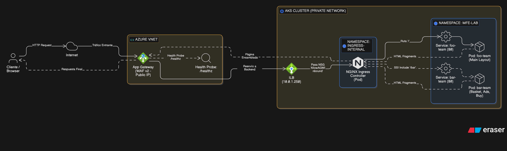

# 🚜 Microfrontends en Azure AKS con App Gateway & SSI

Este proyecto implementa una arquitectura de **Microfrontends** utilizando **Azure Kubernetes Service (AKS)** y **Server Side Includes (SSI)** mediante NGINX Ingress Controller.

La solución expone una tienda de autos compuesta por dos equipos independientes (`foo-team` y `bar-team`) integrados visualmente en una sola página a través de un **Azure Application Gateway (WAF v2)**.


## 🏗️ Arquitectura

El flujo de tráfico es el siguiente:

1.  **Usuario** → Accede a la IP Pública del **App Gateway**.
2.  **App Gateway (WAF)** → Filtra tráfico y lo envía al **Internal Load Balancer (ILB)** del Ingress.
3.  **NGINX Ingress (Interno)** → Recibe la petición en la VNET privada.
    * Ruta `/`: Sirve el `foo-team` (Tienda Principal).
    * Ruta `/bar`: Sirve el `bar-team` (Componentes: Basket, Ads, Buy).
4.  **SSI (Server Side Includes)** → NGINX ensambla el HTML final inyectando los fragmentos de `/bar` dentro de la página de `/foo` antes de responder al usuario.

## 🚀 Requisitos Previos

Necesitas tener instaladas las siguientes herramientas en tu terminal:

* [Azure CLI](https://docs.microsoft.com/en-us/cli/azure/install-azure-cli) (`az login`)
* [Kubectl](https://kubernetes.io/docs/tasks/tools/)
* [Helm](https://helm.sh/docs/intro/install/) (Para instalar NGINX)
* [Docker](https://docs.docker.com/get-docker/) (Para builds locales si fuera necesario)

## 🛠️ Guía de Despliegue (Paso a Paso)

### 1. Despliegue de Infraestructura
Ejecuta el script de aprovisionamiento. Este script crea el Grupo de Recursos, VNet, AKS, ACR, App Gateway y **configura automáticamente el Firewall (NSG) y las Sondas de Salud**.

```bash
chmod +x az-cli-resources.sh
./az-cli-resources.sh

```

> **Nota:** Selecciona la opción **"1) Crear Laboratorio"**. El proceso toma entre 15 y 20 minutos (el App Gateway es lento en crearse).

### 2. Despliegue de Aplicaciones

Una vez terminada la infraestructura, ejecuta el script de despliegue. Este script se encarga de:

* Instalar el **NGINX Ingress Controller** (interno).
* Construir las imágenes Docker de `foo` y `bar`.
* Subirlas a tu Azure Container Registry (ACR).
* Desplegar los Pods, Servicios e Ingress Rules en Kubernetes.

```bash
chmod +x app-deploy.sh
./app-deploy.sh

```

## ✅ Verificación

1. Obtén la IP Pública de tu Application Gateway:
```bash
az network public-ip show -g Lab-Microfrontends-RG -n pip-agw-mfe --query ipAddress -o tsv

```


2. Abre esa IP en tu navegador: `http://<TU_IP_PUBLICA>`
3. Deberías ver la tienda de autos ("The foo Store") con el Ford Focus RS y la barra lateral cargada.

## 🔧 Solución de Problemas (Troubleshooting)

### Error: 502 Bad Gateway

* **Causa:** El App Gateway no puede conectar con el NGINX.
* **Solución:** Verifica las sondas de salud (Health Probes).
```bash
az network application-gateway show-backend-health -g Lab-Microfrontends-RG -n agw-mfe-public --query "backendAddressPools[].backendHttpSettingsCollection[].servers[].[address, health.status]" -o table

```


Si dice **Unhealthy**, espera 5 minutos. Si persiste, verifica que el NGINX esté corriendo: `kubectl get pods -n ingress-internal`.

### Error: Timeout (Tiempo de espera agotado)

* **Causa:** El Firewall (NSG) del AKS está bloqueando la entrada.
* **Solución:** Asegúrate de que las reglas `AllowAGWInbound` y `AllowAzureLBProbe` existan en el NSG del grupo de nodos (`MC_...`). El script `az-cli-resources.sh` debería haberlas creado automáticamente.

### Error: "Cannot copy..." durante el build

* **Causa:** Error de sintaxis en `package.json` en sistemas Linux/Mac.
* **Solución:** Asegúrate de que el comando `cpy` tenga comillas en los asteriscos: `cpy '**' ...`

## 📂 Estructura del Proyecto

* `/foo-team`: Microfrontend Principal (Home, Layout).
* `/bar-team`: Microfrontend Secundario (Fragmentos UI).
* `az-cli-resources.sh`: IaC (Infraestructura como Código) con Azure CLI.
* `app-deploy.sh`: Script de CI/CD simplificado para construir y desplegar.

---

Hecho con ❤️ y mucha paciencia


### Features

Cositas que se podrian implementar a futuro:

1.  **GitHub Actions (CI/CD Real):**
    En lugar de correr `app-deploy.sh` desde la PC, crea un archivo `.github/workflows/deploy.yaml`. Cada vez que hagas un `git push`, GitHub podría construir las imágenes y desplegarlas en AKS automáticamente.

2.  **HTTPS con Let's Encrypt:**
    Actualmente usamos HTTP inseguro. Se podría agregar **Cert-Manager** en Kubernetes para generar certificados SSL automáticos.